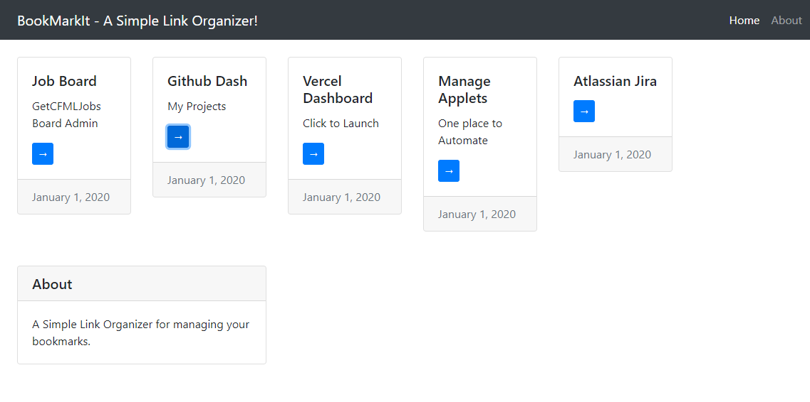

# PyFlaskDoker - Template App
The template App uses two things. The first one is the inclusion of template files in the application. The second part is passing values to the template to load some dynamic data. 
Refer build and Run section of [Base App](https://github.com/Akbarsait/PyFlaskDokr/blob/main/01-BaseApp/README.md)


1. Changes to **app.py**:  We started using *render_template* to load html template files. Flask looks for templates in a templates subdirectory located inside the main application directory. In our case, we have *baseapp/templates* folder to store our html templates. *render_template* function takes the filename of the template as its first argument followed by key-value pairs that represent actual values for variables referenced in the template.

```
return render_template('home.html', vbookmarks=bookmarks)
```

We added a list of dictionaries in python to load some dummy data that can be shared through a key/value pair argument in *render_template. 

```
 bookmarks = [
        {'id': 1, 'name': 'Job Board', 'addinfo': 'GetCFMLJobs Board Admin', 'link': 'getcfmljobs.com'},
        {'id': 2, 'name': 'Github Dash', 'addinfo': 'My Projects', 'link': 'github.com/Akbarsait'},
        {'id': 3, 'name': 'Vercel Dashboard', 'addinfo': 'Click to Launch', 'link': 'vercel.com'},
        {'id': 4, 'name': 'Manage Applets', 'addinfo': 'One place to Automate', 'link': 'ifttt.com'},
        {'id': 5, 'name': 'Atlassian Jira', 'addinfo': '', 'link': 'mycomp.atlassian.net'}
    ]
```

2. **Adding Templates**: We added two template files with the base bootstrap structure to it called *home.html* and *about.html* in the *baseapp/templates* folder. We used control statements inside the *home.html* template to display the values of the list defined in the *app.py* 

```

      <div class="col-sm-2"><br/>
          <div class="card mb-4">
              <div class="card-body">
                  <h5 class="card-title">{{ bookmark.name }}</h5>
                  <p class="card-text">{{ bookmark.addinfo }}</p>
                  <a href="http:\\{{ bookmark.link }}" class="btn btn-primary btn-sm" target="_blank">&rarr;</a>
              </div>
              <div class="card-footer text-muted">January 1, 2020</div>
          </div>
      </div>  
    
```

We are now completed building our second app with a little template flavor to it. Over here is the output of running the templates app. 

