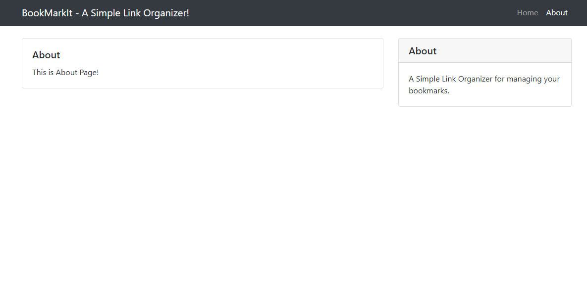

# PyFlaskDoker - Dynamic Templates
The template App uses two things. The first one is the inclusion of template files in the application. The second part is to create a base template and inherit it to home and about templates pages. 

1. Changes to **app.py**:  We started passing additional key-value pairs to  *render_template*. In this with the title of the page. Flask looks for templates in a templates subdirectory located inside the main application directory. 

```python
@app.route("/about")
def about():
    return render_template("about.html", title='About')
```

2. The newly created *layout.html* file includes base HTML for loading the clean UI. The title section content is built dynamically based on the key-value pair passed from *app.py*

```html
<head>

  <meta charset="utf-8">
  <meta name="viewport" content="width=device-width, initial-scale=1, shrink-to-fit=no">
  <meta name="description" content="">
  <meta name="author" content="">
    
    <title>BookMarkIt! - {{ title }}</title>
    
    <title>BookMarkIt! - Home</title>
    
    <!-- Bootstrap CSS -->
    <link rel="stylesheet" href="https://cdn.jsdelivr.net/npm/bootstrap@4.5.3/dist/css/bootstrap.min.css" integrity="sha384-TX8t27EcRE3e/ihU7zmQxVncDAy5uIKz4rEkgIXeMed4M0jlfIDPvg6uqKI2xXr2" crossorigin="anonymous">

</head>
```

3. **Inheriting Base Template**: With the new *layout.html* file available, it can be extended to other layout pages through the *extends* keyword as below. 

```html

<!-- setting the active flag -->

  
      <div class="col-sm-2"><br/>
          <div class="card mb-4">
              <div class="card-body">
                  <h5 class="card-title">{{ bookmark.name }}</h5>
                  <p class="card-text">{{ bookmark.addinfo }}</p>
                  <a href="http:\\{{ bookmark.link }}" class="btn btn-primary btn-sm" target="_blank">&rarr;</a>
              </div>
              <div class="card-footer text-muted">January 1, 2020</div>
          </div>
      </div>  
   
 <!-- /end of block-->
```

We are now completed building our third app with dynamic templates. Over here is the output of running the templates app. 

