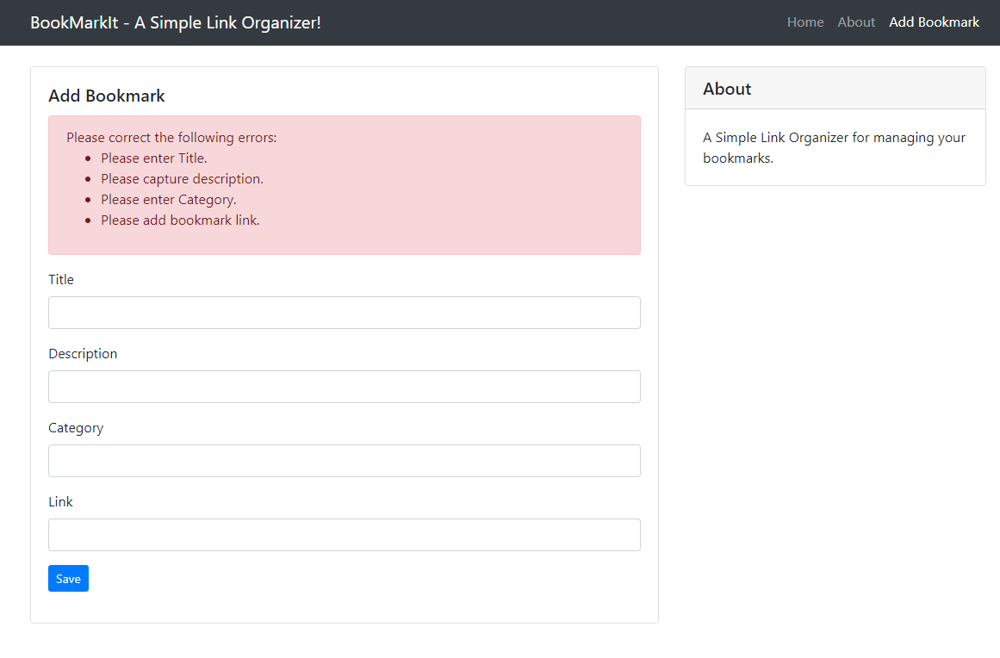

# PyFlaskDoker - Forms
In this build, we are going to create a form to capture user input. Flask WTF will be used to perform the validations to ensure required values are captured. 


1. Let's start first by updating the *requirments.txt* with Flask-WTF includes. 

```python
#flask vsersion
flask==1.1.2
# Application server for both development and production.
gunicorn==20.0.4
werkzeug==0.16.0
#Flask WFT Forms
Flask-WTF==0.14.2
WTForms==2.1
```

2. The next thing is to create a secret key in *app.py*. The value of the secret key serves as a cryptographic key, useful to generate signatures or tokens. The Flask-WTF extension uses it to protect web forms against Cross-Site Request Forgery or CSRF. 

```python
app.config['SECRET_KEY'] = '9791628bb0b19ce0c676dfde280ba243'
```

3. Now let's add a new file to handle our forms fields and validations using the *forms.py* file. Import the wtf validators and fields. Define the class and For each field, an object to be created as a class variable in the *BookmarkForm* class. Each field is given a label as a first argument. The optional validator argument is used to attach validation to the fields. We used *DataValidator* to enforce the field is not submitted empty. *URL* validator is used to ensure a proper URL is submitted in addition to the *Datavalidator*. 

```python
from flask_wtf import FlaskForm
from wtforms import StringField, SubmitField
from wtforms.validators import DataRequired, URL

class BookmarkForm(FlaskForm):
    title       = StringField('Title' , validators=[DataRequired(message='Please enter Title.')])
    description = StringField('Description' , validators=[DataRequired(message='Please capture description.')])
    category    = StringField('Category' , validators=[DataRequired(message='Please enter Category.')])
    link        = StringField('Link' , validators=[DataRequired(message='Please add bookmark link.'), URL(require_tld=True, message='Enter a valid URL')])
    create      = SubmitField('Save')
```

4. Create a new Form template. The fields defined in the *BookmarkForm* class renders the fields as HTML in *addbookmark.html* as follows. 
```html
<form method="POST" action="" novalidate>
    {{ form.hidden_tag() }}
    <!--Error handling-->
    
        <div class="alert alert-danger">
        <span>Please correct the following errors:</span>
        <ul>
            
                
                    <li>{{ error }}</li>
                
            
        </ul>
        </div>
    
    <!-- Display the form -->
    <div class="form-group">
        {{ form.title.label }}
        {{ form.title(class="form-control")}}
    </div>
    <div class="form-group">
        {{ form.description.label }}
        {{ form.description(class="form-control")}}
    </div>
    <div class="form-group">
        {{ form.category.label }}
        {{ form.category(class="form-control")}}
    </div>
    <div class="form-group">
        {{ form.link.label }}
        {{ form.link(class="form-control")}}
    </div>
    <div class="form-group">{{ form.create(class="btn btn-primary btn-sm") }}</div>
</form>
```

    1. We are using the *form.hidden_tag()* argument that generates a hidden field that includes a token to protect the form against CSRF attacks. To get the form protected, we require to include this hidden field and SECRET_KEY variable defined in the Flask configuration. 
    
    2. We are using the form.errors to loop through the error in form submission and customizing it with bootstrap to provide a clear view of the user errors. 


5. Let's do the final handling at the *app.py* to define the route with HTTP methods to handle the form submission. The *form.validate_on_submit()* helps in all the form processing work. We are using the *flash()* to show the success message to the user when the form processing goes well without errors. The *redirect()* function helps to navigate to a different page.  

```python
@app.route("/addbookmark", methods=['GET' , 'POST'])
def addbookmark():
    form = BookmarkForm()
    if form.validate_on_submit():
        flash(f'Bookmark added for {form.title.data} - {form.description.data}')
        return redirect(url_for('home'))
    return render_template("addbookmark.html", title='Add Bookmark', form=form)
```

We are now completed building our fourth app with Forms and dynamic templates. Over here is the output of running the app. 

